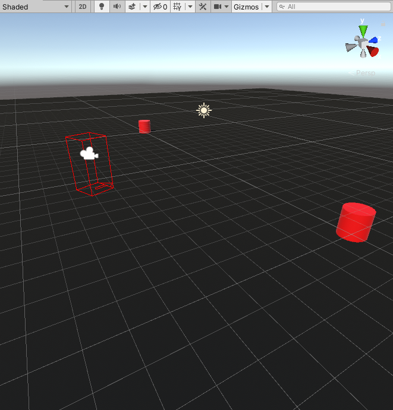
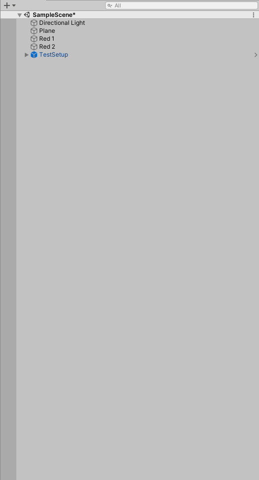
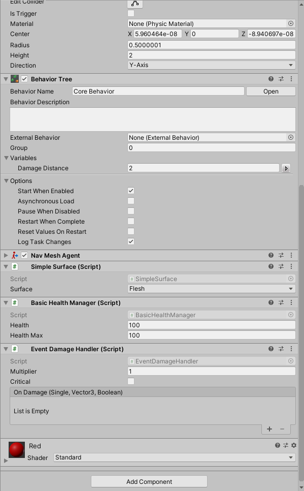

# Devlog for NeoFPS_BehaviourDesigner Version 0.1

## Sunday 8 March 2020, 22:47

Basic Scene Setup

### Details
We have two red cylinders. They are going to attack the player. 

## Sunday 8 March 2020, 23:48

Red 1 moves towards the players position. 

Git Commit: ecb79d3

## Monday 9 March 2020, 00:47

If Red touches player then player takes damage

Git Commit: 71724ca

## Monday 9 March 2020, 20:23

Enemy now takes damage.

Git Commit: 23c4893632856b170d504685a09f246a04111ff3

## Monday 9 March 2020, 21:06

Added BehaviourDesignerIsAlive to test if enemy is alive, destroy the object if it is not alive.

